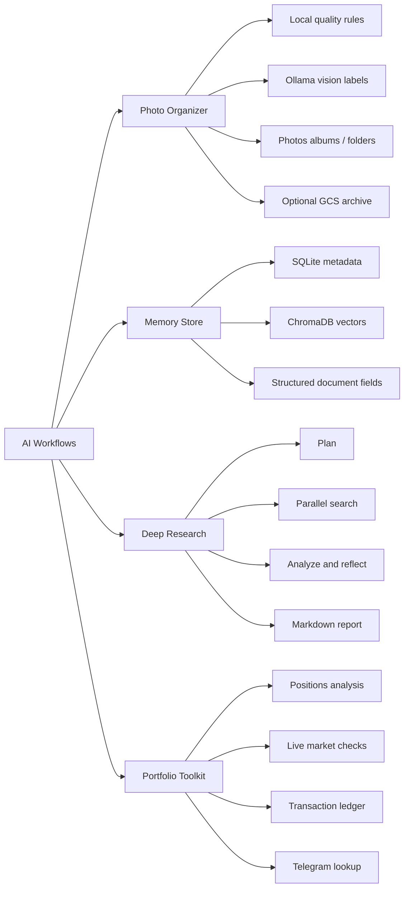
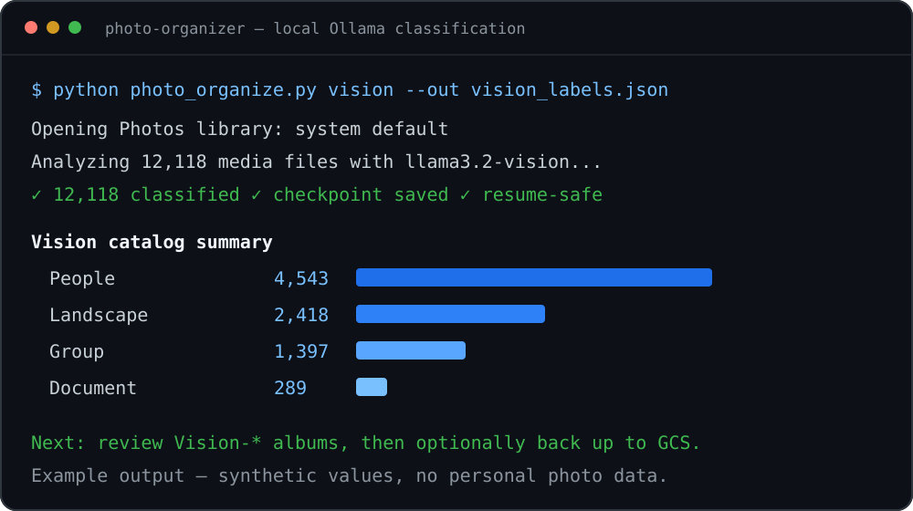
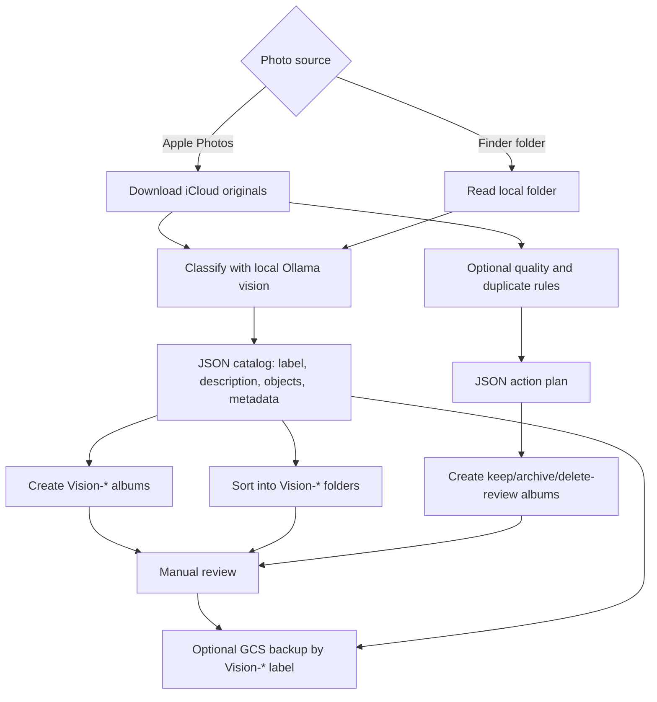
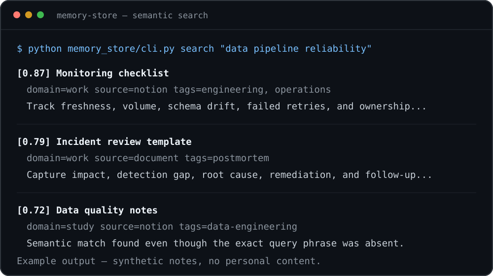
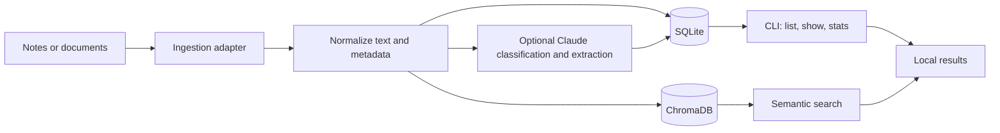
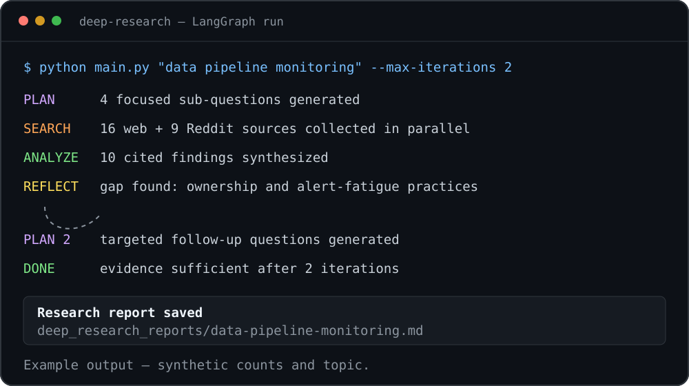
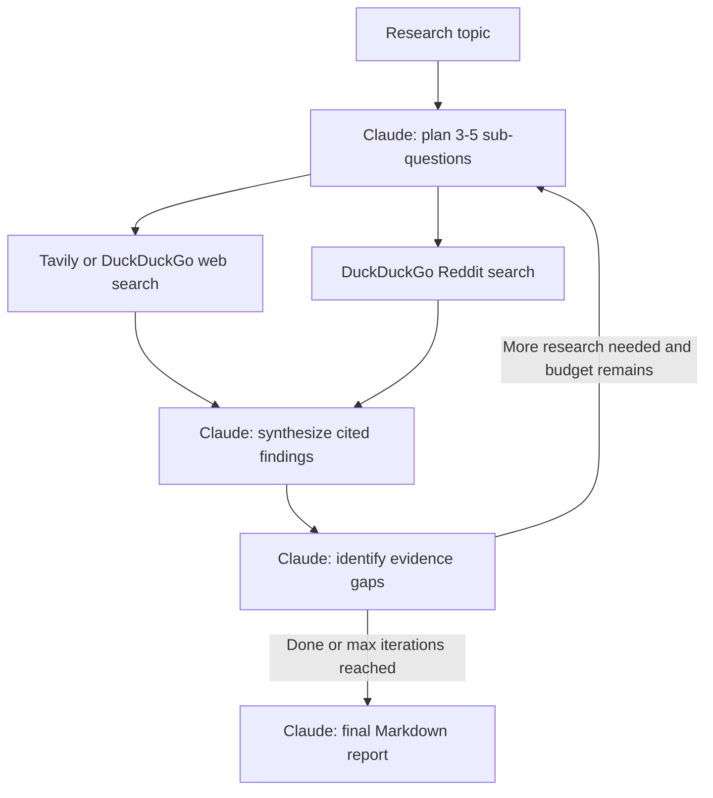
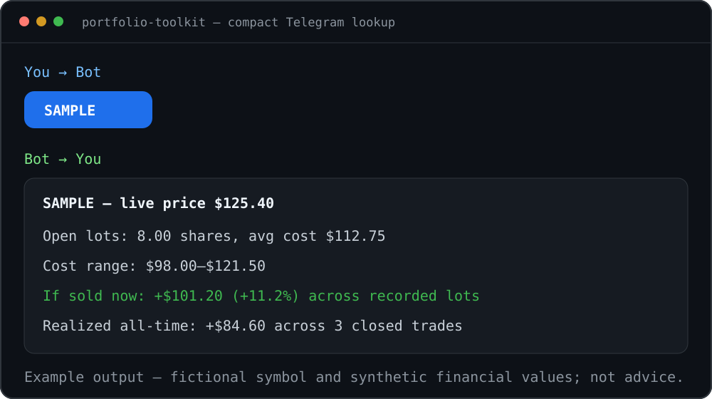
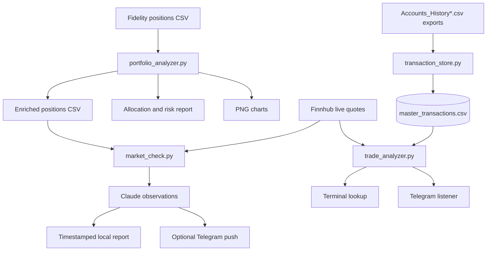

# AI Workflows

A collection of personal automation projects built in Python and designed primarily for macOS. The repository combines local processing, optional local AI through Ollama, cloud APIs where useful, and small command-line tools that can be run manually or scheduled with `launchd`.

> [!IMPORTANT]
> These projects handle personal photos, notes, documents, and financial exports. Runtime data and credentials are intentionally excluded from Git, but some workflows send selected data to external services. Review the [privacy boundaries](#privacy-boundaries) before using them.

## Projects at a glance

| Project | Main entry point | Purpose | Main external services |
|---|---|---|---|
| [Photo Organizer](#1-photo-organizer) | `photo_organize.py` | Classify, review, organize, and archive photos | Ollama, Apple Photos, optional GCS |
| [Memory Store](#2-memory-store) | `memory_store/cli.py` | Store and search notes and structured document data | ChromaDB, optional Notion/Google Drive/Anthropic |
| [Deep Research](#3-deep-research) | `main.py` | Iterative web research with reflection and cited Markdown reports | Anthropic, Tavily or DuckDuckGo, Reddit |
| [Portfolio Toolkit](#4-portfolio-toolkit) | `portfolio_analyzer.py` and related scripts | Analyze Fidelity exports, monitor holdings, and query trade history | Finnhub, Anthropic, optional Telegram |

## Repository architecture



## Requirements

- macOS for Apple Photos integration and the included `launchd` automations
- Python 3 and `venv`
- Ollama for local photo vision classification
- API credentials only for the workflows that use external services

## Installation

```bash
git clone https://github.com/rajeevsingh717/ai-workflows.git
cd ai-workflows

python3 -m venv .venv
source .venv/bin/activate
pip install -r requirements.txt

cp .env.example .env
```

Add only the credentials needed for the projects you intend to run:

```dotenv
# Deep Research, document extraction, and live portfolio summaries
ANTHROPIC_API_KEY=sk-ant-...
ANTHROPIC_MODEL=your-supported-model-name

# Optional Deep Research search provider; DuckDuckGo is the fallback
TAVILY_API_KEY=tvly-...

# Photo Organizer cloud archive
GCS_BUCKET=your-photo-archive-bucket
GOOGLE_APPLICATION_CREDENTIALS=/absolute/path/to/service-account.json

# Portfolio live quotes
FINNHUB_API_KEY=your-finnhub-key

# Optional portfolio notifications and remote trade lookup
TELEGRAM_BOT_TOKEN=your-bot-token
TELEGRAM_CHAT_ID=your-chat-id

# Memory Store Notion integration
NOTION_TOKEN=secret_...
NOTION_DATABASE_ID=00000000000000000000000000000000
```

Never commit `.env`, service-account JSON, exported account data, photo catalogs, generated reports, or local databases.

---

## 1. Photo Organizer

`photo_organize.py` supports two complementary workflows:

1. A deterministic quality pass that uses metadata, blur, darkness, burst, and perceptual-duplicate rules.
2. A richer local vision pass that uses `llama3.2-vision` through Ollama.

Nothing is deleted automatically. The scripts create review queues, albums, or folders; deletion remains a manual decision.

### Example output



*Synthetic preview of a local Ollama classification run; no personal photo data is included.*

### Photo workflow



### Prerequisites

Install [Ollama](https://ollama.com), then pull and start the vision model:

```bash
ollama pull llama3.2-vision
ollama serve
```

For Apple Photos access, grant the terminal application permission under **System Settings → Privacy & Security → Photos**. For GCS backup, configure `GCS_BUCKET` and Google application credentials in `.env`.

### Common commands

```bash
# Download iCloud-only originals to the Mac
python photo_organize.py download

# Test local vision classification on a small batch
python photo_organize.py vision --limit 50 --out vision_labels.json

# Run or resume a full classification while preventing sleep
caffeinate -i python photo_organize.py vision --out vision_labels.json

# Classify a normal Finder folder without Photos.app
python photo_organize.py vision-folder /path/to/photos --out vision_labels.json

# Create Photos.app albums from the catalog
python photo_organize.py vision-albums vision_labels.json

# Move folder-based media into Vision-* subfolders
python photo_organize.py sort-folder vision_labels.json

# Upload reviewed files to GCS by vision label
python photo_organize.py backup vision_labels.json --prefix archive-owner
```

The vision catalog also acts as a searchable index. A filename can be found directly, while fields such as description, objects, setting, event type, people, and detected text allow simple text search across the archive.

### Optional rule-based pass

```bash
python photo_organize.py plan --out plan.json
python photo_organize.py execute plan.json --dry-run
python photo_organize.py execute plan.json
```

The execution phase creates review albums such as `Archived-to-GCP` and `Plan-to-Delete`; it does not delete photos.

---

## 2. Memory Store

The Memory Store provides a local SQLite data model plus ChromaDB semantic search for notes. It also contains document classification and structured-field extraction logic for leases, visas, medical records, insurance documents, tax documents, and identity documents.

### Example output



*Synthetic semantic-search results; no personal notes or document content is included.*

### Memory workflow



### Ingestion setup

For Notion, share the target database with your integration and set both `NOTION_TOKEN` and `NOTION_DATABASE_ID`. For Google Drive, enable the Drive API, create a Desktop OAuth client, and save the downloaded client JSON as `memory_store/gdrive_credentials.json`; the generated OAuth token is stored locally and excluded from Git.

### Available CLI

```bash
python memory_store/cli.py --help
python memory_store/cli.py sync-notion --limit 10
python memory_store/cli.py auth-gdrive
python memory_store/cli.py ingest /path/to/document.pdf
python memory_store/cli.py ingest "https://drive.google.com/file/d/.../view"
python memory_store/cli.py search "query" --n 5
python memory_store/cli.py list --domain work --limit 50
python memory_store/cli.py show "title keyword"
python memory_store/cli.py stats
python memory_store/cli.py docs
python memory_store/cli.py doc-show 1
```

Runtime data is stored under `memory_store/memory.db` and `memory_store/chroma/`, both excluded from Git.

---

## 3. Deep Research

The Deep Research workflow uses LangGraph to turn a broad question into focused sub-questions, search the web and Reddit in parallel, synthesize findings, critique remaining gaps, and repeat until the report is ready or the iteration limit is reached.

### Example output



*Synthetic run summary showing the plan → search → analyze → reflect loop.*

### Research graph



### Usage

```bash
# Print a report to the terminal
python main.py "best practices for data pipeline monitoring"

# Use three plan/search/analyze/reflect iterations
python main.py "best practices for data pipeline monitoring" --max-iterations 3

# Save the final Markdown report
python main.py "best practices for data pipeline monitoring" \
  --max-iterations 3 \
  --out deep_research_reports/data-pipeline-monitoring.md
```

`ANTHROPIC_API_KEY` is required. `TAVILY_API_KEY` is optional; without it, web search falls back to DuckDuckGo. Generated reports under `deep_research_reports/` are excluded from Git.

---

## 4. Portfolio Toolkit

The Portfolio Toolkit is a group of local scripts for Fidelity CSV exports. It separates deterministic calculations from AI-generated commentary and never places trades.

> [!CAUTION]
> This project is informational software, not financial, investment, tax, or legal advice. Validate calculations against official account statements and trade confirmations.

### Example output



*Synthetic Telegram response using a fictional symbol and values; it is not investment advice.*

### Portfolio data flow



### Directory convention

```text
fidelity_data/
├── Portfolio_Positions_*.csv
├── order_transactions/
│   ├── Accounts_History*.csv
│   └── master_transactions.csv
└── output/
    ├── portfolio_report_*.txt
    ├── positions_enriched_*.csv
    ├── chart_*.png
    └── market_check_*.txt
```

The complete `fidelity_data/` directory is excluded from Git.

### Portfolio snapshot analysis

```bash
# Automatically use the newest Fidelity positions export
python portfolio_analyzer.py

# Or provide a specific export and output directory
python portfolio_analyzer.py /path/to/Portfolio_Positions.csv --out /path/to/output
```

The analyzer cleans Fidelity formatting, classifies known securities, calculates allocation and performance, identifies position/sector concentration and overlapping funds, performs a basic tax-location check, and creates four charts.

Security classification is maintained in the `SECURITY_INFO` mapping inside `portfolio_analyzer.py`. New symbols are reported as unclassified so the mapping can be updated explicitly.

### Live market check

```bash
python market_check.py
```

This command loads the newest enriched positions file, verifies that the US market is open, fetches live Finnhub quotes, recalculates portfolio weights, and asks Claude for concise observations based on the supplied portfolio facts. It writes a timestamped report and optionally pushes the summary to Telegram.

The included schedule runs at 9:35 a.m., 12:30 p.m., and 3:45 p.m. on weekdays in the Mac's local timezone:

```bash
./setup_launchd.sh
launchctl list | grep marketcheck
tail -f fidelity_data/output/market_check.log
```

The setup script generates a machine-local plist using the current checkout path and generic label `com.aiworkflows.marketcheck`. The schedule uses launchd weekdays `2–6` (Monday–Friday). The stated times follow the Mac's local timezone; they align with US market hours only when the Mac is configured for Eastern Time.

### Transaction ledger and trade lookup

Drop new Fidelity transaction exports into `fidelity_data/order_transactions/`. On each run, `transaction_store.py` merges all `Accounts_History*.csv` files into an append-only, deduplicated `master_transactions.csv`. Removing a source export after it has been merged does not remove its transactions from the master ledger.

```bash
# Optional explicit merge with counts
python merge_transactions.py

# Overall realized P&L summary using FIFO matching
python trade_analyzer.py

# Full history, open lots, live quote, and realized round trips for one symbol
python trade_analyzer.py AMD
```

FIFO matching is performed per account and symbol. If a sell references shares bought before the earliest imported export, the script reports that portion as unmatched rather than inventing a cost basis.

### Telegram trade lookup

After configuring `TELEGRAM_BOT_TOKEN` and `TELEGRAM_CHAT_ID`:

```bash
# Foreground test
python telegram_listener.py

# Install the persistent macOS listener
./setup_telegram_listener.sh
launchctl list | grep telegramlistener
```

| Telegram message | Response |
|---|---|
| `AMD` | Compact live price, open-lot range, realized total, and blended position |
| `AMD full` | Complete transaction-by-transaction output |
| `summary` | Realized P&L summary across the imported ledger |
| `help` | Command reference |

The listener processes commands only from the configured chat ID. The Mac must remain powered on, awake, and online because the bot runs locally.

---

## Privacy boundaries

| Workflow | Stays local | May leave the Mac |
|---|---|---|
| Photo Organizer | Photo analysis through local Ollama; local albums/folders | Reviewed archive files and JSON catalog when GCS backup is used |
| Memory Store | SQLite, ChromaDB, local search | Notion/Drive content through their APIs; document text/images sent to Anthropic when extraction is used |
| Deep Research | Final report file and local execution state | Topic, prompts, and gathered source text sent to Anthropic; searches sent to Tavily/DuckDuckGo/Reddit |
| Portfolio Toolkit | Raw Fidelity CSVs, master ledger, deterministic reports/charts | Symbols and quote requests sent to Finnhub; summarized portfolio facts sent to Anthropic; selected summaries sent to Telegram when enabled |

## Generated and private files

The current `.gitignore` excludes:

- `.env` and credential JSON patterns
- Python virtual environments and caches
- photo label catalogs and rule plans
- Memory Store SQLite/ChromaDB data
- generated deep-research reports
- the entire `fidelity_data/` tree

Before publishing a fork, run your own secret scanner against the full Git history; `.gitignore` prevents future commits but does not erase files committed in the past.

## Repository layout

```text
.
├── photo_organize.py              # Photo CLI and Ollama/GCS workflows
├── photo_quality.py               # Blur, darkness, and perceptual-hash utilities
├── photo_rules.py                 # Deterministic photo classification rules
├── memory_store/
│   ├── cli.py                     # Memory/document CLI
│   ├── store.py                   # SQLite and ChromaDB persistence
│   ├── document.py                # Claude document classification/extraction
│   └── ingest/                    # Notion, Drive, PDF, and image adapters
├── main.py                        # Deep Research CLI
├── research_graph.py              # LangGraph research state machine
├── search_tools.py                # Tavily, DuckDuckGo, and Reddit helpers
├── portfolio_analyzer.py          # Fidelity positions analysis and charts
├── market_check.py                # Live quotes and Claude observations
├── transaction_store.py           # Deduplicated transaction master ledger
├── merge_transactions.py          # Manual ledger sync command
├── trade_analyzer.py              # FIFO trade-history lookup
├── telegram_listener.py           # Remote Telegram trade lookup
├── generate_launchd_plist.py      # Portable launch-agent generator
├── setup_launchd.sh               # Market-check scheduler installer
├── setup_telegram_listener.sh     # Telegram listener installer
├── tests/                         # Public-readiness unit tests
└── requirements.txt
```

## Public-release status

The repository is currently **private** on GitHub. Public-readiness work completed in this tree includes portable launch-agent generation, generic configuration examples, restored Memory Store ingestion adapters, synthetic README visuals, unit tests, CI secret scanning, `SECURITY.md`, and `CONTRIBUTING.md`.

A scan of the publishable current tree found no API tokens, service-account private keys, Fidelity exports, photo catalogs, generated reports, or local databases. A full-history Gitleaks scan found one removed legacy workflow containing an OpenAI API-key pattern; that historical object must be removed before changing visibility.

- Choose and add a `LICENSE`; without one, others can view the code but do not receive permission to reuse it.
- Rewrite the Git history to remove the flagged legacy workflow, force-push the cleaned history, and rerun Gitleaks.
- Rotate any credential that has appeared in a chat, issue, CI log, terminal recording, or other external system, even if it was never committed.
- Review the final staged diff before pushing and changing visibility.

After those final checks and the license decision, changing the GitHub repository from private to public should be reasonable.

## Future improvements

- Add automated tests for CSV cleaning, transaction deduplication, and FIFO matching.
- Add cached market data and clearer provenance/timestamps to AI-generated observations.
- Add structured logging and health checks for the two background jobs.
